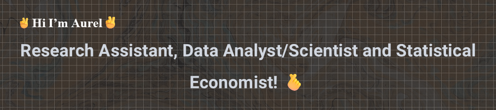

## **Hi, I’m Aurel, a Reasearch Assistant, Data Analyst/Scientist and Statistical Economist!👋**

🎓 Master’s student in <strong>Economic Data Expertise and Analysis</strong> at <strong>Université Côte d’Azur</strong>. 
🌍 Passionate about tackling <strong>economic</strong> and <strong>social challenges</strong> through <strong>data</strong>. 
💻 Building strong skills in <strong>economics</strong>, <strong>machine learning</strong>, <strong>data analysis</strong>, and <strong>programming</strong>. 
📊 I take a <strong>data-driven</strong> and <strong>analytical approach</strong> to solving <strong>complex problems</strong>. 
🚀 Always eager to <strong>learn</strong>, <strong>collaborate</strong>, and contribute to <strong>impactful projects</strong>.  
🔗 <a href="https://aurvl.github.io/portfolio/index.html" target="_blank"><strong>View my Portfolio</strong></a>

## 🌐 Socials:
 

## 💻 Tech Stack
               

## 📊 GitHub Stats

<!--
-->
## 🏆 GitHub Trophies

