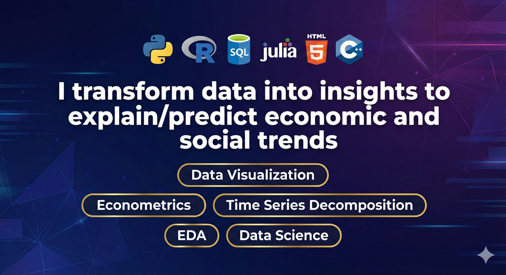

# **Aurel Vehi**
**`Data Scientist | Econometrics & Modeling`**

---

## FR

Data Scientist spécialisé en économétrie, modélisation statistique et data science appliquée. Je construis des solutions analytiques pour des enjeux économiques, environnementaux et décisionnels sur l'ensemble de la chaîne data (de la collecte aux insights).

**Intérêts :** Séries temporelles, nowcasting, économie environnementale, ML/deep learning, finance durable, Neuro-Symbolic AI.

---

## EN

Data Scientist specialized in econometrics, statistical modeling, and applied data science. I build analytical solutions for economic, environmental, and business challenges across the full data pipeline (from collection to insights).

**Interests:** Time series analysis, nowcasting, environmental economics, ML/deep learning, sustainable finance, Neuro-Symbolic AI.

---
## My Socials

- 
- 
- 
- 
- 

<!--  -->

<!---## **Tech Stack**
               
--->
<!---Other stacks...--->
---

## **Recent projects**
<table>
  <tr>
    <td align="center" width="33%">
      
       
      <b>House Price Prediction</b> 
      <a href="https://github.com/aurvl/Housing-Price-Prediction">Repo</a> 
      Tags: ML, Regression, Python 
    </td> <!---Fin--->
    <td align="center" width="33%">
      
       
      <b>Research Papers Recommandation System</b> 
      <a href="https://github.com/aurvl/ResearchPapersRecommandationSystem">Repo</a> 
      Tags: NLP, Python, Recom. System 
    </td> <!---Fin--->
    <td align="center" width="33%">
      
       
      <b>CNN Fear & Greed Estimator</b> 
      <a href="https://github.com/aurvl/FGIndexEstimator">Repo</a> 
      Tags: Market Finance, Statistical Modeling, Data Processing 
    </td> <!---Fin--->
  </tr>
</table>

## **GitHub Stats**

<!---->

<!--
-->
<!---->
